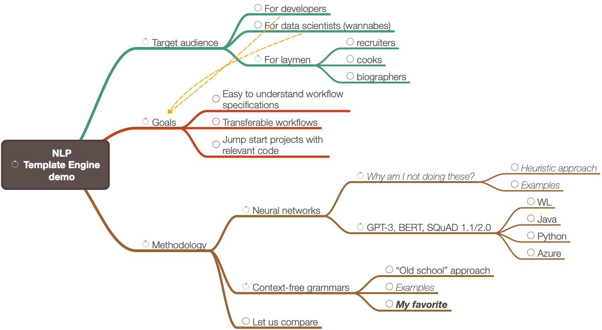

---

# Natural Language Processing Template Engine

**Part 1**

**Code generation using semantic parsing of computational workflows specifications via Question Answering Systems**

Anton Antonov   
Accendo Data LLC   
[NLP-Template-Engine at GitHub](https://github.com/antononcube/NLP-Template-Engine)   
[MathematicaForPrediction at GitHub](https://github.com/antononcube/MathematicaForPrediction)   
[MathematicaForPrediction at WordPress](http://mathematicaforprediction.wordpress.com)   

October 2021

[***Video recording at YouTube***](https://youtu.be/a6PvmZnvF9I)

---

## Abstract

### Part 1

- Problem formulation

- Big picture

- Demo examples

- Interactive interface

- Walkthrough

- Design

- Bring your templates 

    - Short demo

### Part 2

- Introspection

- Workflow classifier training

- Bring your own templates 

    - Extensive examples

---

## Introduction

### Problem formulation

We want to have a system -- Template Engine (TE) -- that:

1. Generates relevant, correct, executable programming code based natural language specifications of computational workflows

1. Can automatically recognize the workflow types 

1. Can generate code for different programming languages and related software packages

The points above are given in order of importance; the most important are placed first.

### Question answering system

In this presentation we outline the functionalities and software design of a system that generates executable code based on natural language specifications

The system belongs to the type of software generally known as “template processor” or “template engine”, [Wk2].

The system uses a specialized Question Answering System (QAS), [Wk2], that is based on a generic, open QAS built-in in Wolfram Language (WL) --  see [FindTextualAnswer](https://reference.wolfram.com/language/ref/FindTextualAnswer.html), [WRI1, JL1].

```mathematica
FindTextualAnswer[
  "Today it is 45 degrees hot, I think.", 
  "What is the temperature?"]

(*"45 degrees hot"*)
```

---

## Introduction: examples

For example, consider the following -- intentionally short and non-specific -- computational workflow specifications:

```mathematica
lsCommands = {
    "Create a random dataset.", 
    "Do quantile regression over dfFinData.", 
    "Make a classifier over dsTitanic."};
```

Here we generate the code -- note the only the list of commands is given to the function Concretize, [[AAp1](https://github.com/antononcube/MathematicaForPrediction/blob/master/Misc/ComputationalSpecCompletion.m)]:

```mathematica
aRes = Concretize[lsCommands];
```

Here we tabulate the code generation results (i.e. computational templates that are filled-in):

```mathematica
ResourceFunction["GridTableForm"][aRes] // Magnify[#, 0.8] &
```


---

## The “big picture”

### QAS

- General/open and specialized/closed QAS can be made in a variety ways.

- Here we present a general QAS that is specialized into a “computational workflows” one.

    - It uses one or several neural networks.

### Motivation

- Rapid specification of prediction (computational) workflows using natural language commands.

    - Data science, Machine learning, Scientific computing

- Too many packages and languages for doing prediction computations.

- Same workflows, but different syntax and “small” details.

### Target audience

Data science, data analysis, and scientific computing practitioners. 

(Professionals, wannabes, full time, part time, etc.)

---

## Disclaimers

I do not “believe“ that much in using “stochastic” QAS for producing executable code. I think that kind of approach is second or third best. Nevertheless, I tried to do an “intellectually honest” and “complete enough” effort to make the described approach work and be useful. At some point, though, I started considering further development to produces too little Return Of Investment (ROI).

The best approach is to use a combination of grammar-based and stochastic-QAS-based methods. In my view, in such combined system, the precision of responses is handled by the grammar-based part, and the flexibility and generality by the stochastic based part. Such system would also adhere to the UNIX philosophy principle: “build tools for experienced users.” (While also being useful to new-comers.)

---

## Comparison mind-map

```mathematica
plMindMap = Import["~/Documents/Conceptual diagrams/NLP Template Engine/Conversational-agents-with-QAS-demo-mind-map.png"]
```



---

## Pareto principle in ML

We can say that 60-80% ML workflows are covered by the four types of ***workflows:***

- Classification

- Quantile Regression (QR)

- Latent Semantic Analysis (LSA)

- Recommendations

Within each workflow type 60-75% are “just” one standard workflow.

### LSA

80% LSA workflows are like this:

```mathematica
Concretize["Templates"]["LatentSemanticAnalysis"]["WL"]

(*TemplateObject[{"lsaObj=LSAMonUnit[", TemplateSlot["textData"], "] \[DoubleLongRightArrow]LSAMonMakeDocumentTermMatrix[ \"StemmingRules\" -> ", TemplateSlot["stemmingRules"], ", \"StopWords\" -> ", TemplateSlot["stopWords"], "] \[DoubleLongRightArrow]LSAMonEchoDocumentTermMatrixStatistics[\"LogBase\" -> 10] \[DoubleLongRightArrow]LSAMonApplyTermWeightFunctions[\"GlobalWeightFunction\" -> \"", TemplateSlot["globalWeightFunction"], "\", \"LocalWeightFunction\" -> \"", TemplateSlot["localWeightFunction"], "\", \"NormalizerFunction\" -> \"", TemplateSlot["normalizerFunction"], "\"] \[DoubleLongRightArrow]LSAMonExtractTopics[\"NumberOfTopics\" -> ", TemplateSlot["numberOfTopics"], ", Method -> \"", TemplateSlot["method"], "\", \"MaxSteps\" -> ", TemplateSlot["maxSteps"], ", \"MinNumberOfDocumentsPerTerm\" -> ", TemplateSlot["minNumberOfDocumentsPerTerm"], "] \[DoubleLongRightArrow]LSAMonEchoTopicsTable[\"NumberOfTerms\" -> ", TemplateSlot["topicsTableNumberOfTerms"], "] \[DoubleLongRightArrow]LSAMonEchoStatisticalThesaurus[ \"Words\" -> ", TemplateSlot["statThesaurusWords"], "];"}, CombinerFunction -> StringJoin, InsertionFunction -> TextString]*)
```

Let us concretize it:

```mathematica
Concretize["Make latent semantic analysis workflow for aAbstracts."]
```

```mathematica
lsaObj = 
   LSAMonUnit[aAbstracts]\[DoubleLongRightArrow]
    LSAMonMakeDocumentTermMatrix["StemmingRules" -> Automatic, "StopWords" -> Automatic]\[DoubleLongRightArrow]LSAMonEchoDocumentTermMatrixStatistics["LogBase" -> 10]\[DoubleLongRightArrow]LSAMonApplyTermWeightFunctions["GlobalWeightFunction" -> "IDF", "LocalWeightFunction" -> "None", "NormalizerFunction" -> "Cosine"]\[DoubleLongRightArrow]LSAMonExtractTopics["NumberOfTopics" -> 20, Method -> "SVD", "MaxSteps" -> 16, "MinNumberOfDocumentsPerTerm" -> 20]\[DoubleLongRightArrow]LSAMonEchoTopicsTable["NumberOfTerms" -> 10]\[DoubleLongRightArrow]
    LSAMonEchoStatisticalThesaurus["Words" -> {"notebook", "function", "neural"}];
```


---

## Interactive interface

Here is an interactive interface that gives “online” access to the functionalities discussed: https://antononcube.shinyapps.io/DSL-evaluations/ .


---

## Interactive interface: components diagram

```mathematica
plDSLWebServiceWithWE = Import["https://github.com/antononcube/RakuForPrediction-book/raw/main/Part-0-Introduction/Diagrams/DSL-Web-Service-via-Cro-with-WE-QAS.jpg"];
plDSLWebServiceWithWE = ImageCrop[plDSLWebServiceWithWE]
```


The interactive interface utilizes:

- A server at RStudio’s [shinyapps.io](https://www.shinyapps.io)

    - Launched on demand

- A server / droplet at [DigitalOcean](https://www.digitalocean.com)

    - Permanent

- [Raku](https://raku.org) and the [Raku package Cro](https://cro.services)

- [Wolfram Engine](https://www.wolfram.com/engine/) (WE) connected to Raku through [ZeroMQ](https://zeromq.org)

    - WE is free for developers

---

## NLP Template Engine Design

```mathematica
plSpecCompl = Import["https://raw.githubusercontent.com/antononcube/RakuForPrediction-book/main/Part-0-Introduction/Diagrams/Computation-spec-completion-by-QAS.jpg"];
plSpecCompl = ImageTake[plSpecCompl, {50, -150}, {50, -20}]
```


---

## Example: Classification

Here is a classification workflow specification and the corresponding template filled-in:

```mathematica
clCommand = "Make a classifier for the data dsTitanic and using the method RandomForest. Show TruePositve rate and FalsePositiveRate.";
```

Here we generate code for the a typical ML classification workflow, [AAp3]:

```mathematica
clRes = Concretize["ClCon", clCommand]

(*Hold[clObj = ClConUnit[dsTitanic]\[DoubleLongRightArrow]ClConSplitData[0.75]\[DoubleLongRightArrow]ClConEchoDataSummary\[DoubleLongRightArrow]ClConMakeClassifier["RandomForest"]\[DoubleLongRightArrow]ClConClassifierMeasurements[{"data dsTitanic"}]\[DoubleLongRightArrow]ClConEchoValue\[DoubleLongRightArrow]ClConROCPlot[{"FPR", "TPR"}];]*)
```

```mathematica
GetAnswers["ClCon", clCommand]

(*<|"data" -> "dsTitanic", "method" -> "RandomForest", "measurementFuncs" -> {"\"data dsTitanic\""}|>*)
```

```mathematica
GetRawAnswers["ClCon", clCommand]

(*<|"Which dataset to use" -> <|"RandomForest" -> 0.690764, "method" -> 0.176898, "the" -> 0.0656918, "Show TruePositve rate and FalsePositiveRate" -> 0.0522525|>, "Which data" -> <|"dsTitanic" -> 0.381885, "TruePositve rate and FalsePositiveRate" -> 0.150135, "RandomForest" -> 0.0629023, "data" -> 0.0609455|>, "Which data to use" -> <|"RandomForest" -> 0.588241, "dsTitanic" -> 0.312395, "method" -> 0.166011, "TruePositve rate and FalsePositiveRate" -> 0.104979|>, "For which data" -> <|"dsTitanic" -> 0.786549, "data" -> 0.142859, "RandomForest" -> 0.118607, "TruePositve rate and FalsePositiveRate" -> 0.0794206|>, "For which dataset" -> <|"data dsTitanic" -> 0.593362, "RandomForest" -> 0.165753, "classifier" -> 0.0920831, "the" -> 0.0519749|>, "Using which dataset" -> <|"RandomForest" -> 0.744375, "method" -> 0.226767, "the" -> 0.0875358, "classifier for the data dsTitanic" -> 0.0594997|>, "Over which dataset" -> <|"data dsTitanic" -> 0.083324, "classifier" -> 0.0647558, "RandomForest" -> 0.0381265, "FalsePositiveRate" -> 0.0367743|>, "What is the split ratio" -> <|"TruePositve rate and FalsePositiveRate" -> 0.293568, "Make a classifier for the data dsTitanic and using the method RandomForest" -> 0.0313739, "Show" -> 0.0271399, "." -> 0.0206346|>, "Which split ratio to use" -> <|"RandomForest" -> 0.533841, "TruePositve rate and FalsePositiveRate" -> 0.387896, "method" -> 0.114225, "the" -> 0.0468542|>, "Training vs testing data  ratio" -> <|"TruePositve rate and FalsePositiveRate" -> 0.231984, "classifier" -> 0.0634268, "Show" -> 0.0495659, "data dsTitanic and using the method RandomForest" -> 0.0480153|>, "Which classifier method" -> <|"RandomForest" -> 0.866215, "method" -> 0.0940694, "data dsTitanic" -> 0.0848199, "Show TruePositve rate and FalsePositiveRate" -> 0.0759387|>, "What kind of classifier" -> <|"data dsTitanic" -> 0.324587, "RandomForest" -> 0.179041, "a classifier" -> 0.112572, "TruePositve rate and FalsePositiveRate" -> 0.0901907|>, "How to classify" -> <|"data dsTitanic" -> 0.203054, "using the method RandomForest" -> 0.104762, "Show TruePositve rate and FalsePositiveRate" -> 0.0434416, "Make a classifier" -> 0.0380221|>, "Which classifier algorithm" -> <|"RandomForest" -> 0.7283, "data dsTitanic" -> 0.189918, "method" -> 0.112103, "Show TruePositve rate and FalsePositiveRate" -> 0.0882101|>, "Classifier measurements" -> <|"data dsTitanic" -> 0.183448, "RandomForest" -> 0.0346944, "Show TruePositve rate and FalsePositiveRate" -> 0.021885, "Make a classifier" -> 0.0153996|>, "Which evaluation metrics" -> <|"data dsTitanic" -> 0.417067, "method RandomForest" -> 0.107987, "TruePositve rate and FalsePositiveRate" -> 0.099116, "classifier" -> 0.0474028|>, "Which measurements" -> <|"data dsTitanic and using the method RandomForest. Show TruePositve rate and FalsePositiveRate" -> 0.0764669, "classifier" -> 0.0219666, "." -> 0.00993411, "Make" -> 0.00443023|>, "Which ROC functions" -> <|"data dsTitanic" -> 0.125331, "TruePositve rate and FalsePositiveRate" -> 0.0953823, "RandomForest" -> 0.0376552, "classifier" -> 0.0217193|>, "Which ROC plot functions" -> <|"data dsTitanic" -> 0.169438, "TruePositve rate and FalsePositiveRate" -> 0.110079, "RandomForest" -> 0.0522398, "classifier" -> 0.0199706|>|>*)
```

Here the code generated above is evaluated:

---

## Example: Classification (ClCon)

Here is a classification workflow specification and the corresponding template filled-in:

```mathematica
clCommand = "Make a classifier for the data dsTitanic and using the method RandomForest. Show TruePositve rate and FalsePositiveRate.";
```

Here we generate code for the software monad ClMon, [AAp3]:

```mathematica
clRes = Concretize["ClCon", clCommand]

(*Hold[clObj = ClConUnit[dsTitanic]\[DoubleLongRightArrow]ClConSplitData[0.75]\[DoubleLongRightArrow]ClConEchoDataSummary\[DoubleLongRightArrow]ClConMakeClassifier["RandomForest"]\[DoubleLongRightArrow]ClConClassifierMeasurements[{"data dsTitanic"}]\[DoubleLongRightArrow]ClConEchoValue\[DoubleLongRightArrow]ClConROCPlot[{"FPR", "TPR"}];]*)
```

Here the code generated above is evaluated:

```mathematica
clRes // ReleaseHold
```

**Remark:** Note that the correct dataset name and classifier method are filled-in in the ClCon template.

**Remark:** Due to some wrong answers for the classifier measures different measures are given. 

---

## Example: Latent Semantic Analysis (LSAMon)

Here is a LSA workflow specification and the corresponding template filled-in:

```mathematica
lsaCommand = "Extract 20 topics from the text corpus aAbstracts using the method NNMF. Show statistical thesaurus with the words neural, function, and notebook";
```

Here we generate code for the software monad LSAMon, [AAp4]:

```mathematica
lsaRes = Concretize["LSAMon", lsaCommand]

(*Hold[lsaObj = LSAMonUnit[aAbstracts]\[DoubleLongRightArrow]LSAMonMakeDocumentTermMatrix["StemmingRules" -> Automatic, "StopWords" -> Automatic]\[DoubleLongRightArrow]LSAMonEchoDocumentTermMatrixStatistics["LogBase" -> 10]\[DoubleLongRightArrow]LSAMonApplyTermWeightFunctions["GlobalWeightFunction" -> "IDF", "LocalWeightFunction" -> "None","NormalizerFunction" -> "Cosine"]\[DoubleLongRightArrow]LSAMonExtractTopics["NumberOfTopics" -> 20, Method -> "NNMF", "MaxSteps" -> 16, "MinNumberOfDocumentsPerTerm" -> 20]\[DoubleLongRightArrow]LSAMonEchoTopicsTable["NumberOfTerms" -> 10]\[DoubleLongRightArrow]LSAMonEchoStatisticalThesaurus["Words" -> {"neural", "function", "notebook"}];]*)
```

Here the code generated above is evaluated:

```mathematica
lsaRes // ReleaseHold
```


**Remark:** Note that the correct dataset name, dimension reduction method, number of topics, and statistical thesaurus are filled-in in the LSAMon template.

---

## Example: Quantile Regression

Here is QR workflow specification:

```mathematica
qrCommand = "Do quantile regression with 22 knots and probabilities 0.1, 0.5 and 0.7 over the dataset dfTemperatureData. Use a datelist plot.";
```

Here we generate code for the a typical statistical regression workflow based on QR, [AAp5]:

```mathematica
qrRes = Concretize["QRMon", qrCommand, "TargetLanguage" -> "WL"]

(*Hold[qrObj = QRMonUnit[dfTemperatureData]\[DoubleLongRightArrow]QRMonEchoDataSummary[]\[DoubleLongRightArrow]QRMonQuantileRegression[22, {0.1, 0.5, 0.7}, InterpolationOrder -> 3]\[DoubleLongRightArrow]QRMonPlot["DateListPlot" -> True, PlotTheme -> "Detailed"]\[DoubleLongRightArrow]QRMonErrorPlots["RelativeErrors" -> False, "DateListPlot" -> True, PlotTheme -> "Detailed"];]*)
```

Here we evaluate the generated code:

```mathematica
qrRes // ReleaseHold
```


---

## Example: Quantile Regression (QRMon)

Here is QR workflow specification:

```mathematica
qrCommand = "Do quantile regression with 22 knots and probabilities 0.1, 0.5 and 0.9 over the dataset dfTemperatureData. Use a datelist plot.";
```

```mathematica
qrCommand2 = "Do quantile regression with 22 knots and probabilities 0.1, 0.5 and 0.9 over the dataset dfTemperatureData. Use a datelist plot. Using interpolation order 2.";
```

Here we generate code for the software monad QRMon, [AAp5]:

```mathematica
qrRes = Concretize["QRMon", qrCommand]
```

Here we evaluate the generated code:

```mathematica
qrRes // ReleaseHold
```

**Remark:** Note that the correct dataset name, number of knots, probabilities, and data list plot Boolean indicator are filled-in in the QRMon template.

### Details

```mathematica
Concretize["Questions"]["QRMon"]
```

```mathematica
GetRawAnswers["QRMon", qrCommand]

(*<|"How many knots" -> <|"22" -> 0.876144, "knots" -> 0.185293, "0.1, 0.5 and 0.9" -> 0.0395985, "regression" -> 0.0357663|>, "What is the interpolation order" -> <|"22 knots and probabilities 0.1, 0.5 and 0.9" -> 0.642461, "dataset dfTemperatureData" -> 0.184662, "Do quantile regression" -> 0.156881, "a datelist plot" -> 0.0546214|>, "Data summary" -> <|"Use a datelist plot." -> 0.0162125, "Do quantile regression with 22 knots and probabilities 0.1, 0.5 and 0.9 over the dataset dfTemperatureData" -> 0.010631|>, "Which axes to rescale" -> <|"0.1, 0.5 and 0.9" -> 0.300245, "probabilities" -> 0.0618842, "22 knots" -> 0.0480123, "dataset dfTemperatureData" -> 0.022151|>, "What kind of plot" -> <|"datelist" -> 0.762102, "plot" -> 0.165112, "a" -> 0.0829512, "Use" -> 0.0594855|>, "Date list plot" -> <|"datelist plot" -> 0.321922, "." -> 0.0513163, "Do quantile regression with 22 knots and probabilities 0.1, 0.5 and 0.9 over the dataset dfTemperatureData" -> 0.0430315, "Use a" -> 0.0416646|>, "Relative errors plot" -> <|"datelist plot" -> 0.187451, "probabilities 0.1, 0.5 and 0.9 over the dataset dfTemperatureData" -> 0.0438595, "." -> 0.0326321, "Do quantile regression" -> 0.0283627|>, "Absolute errors plot" -> <|"datelist plot" -> 0.253815, "probabilities 0.1, 0.5 and 0.9 over the dataset dfTemperatureData" -> 0.039403, "." -> 0.0378334, "a" -> 0.0358111|>, "Which dataset to use" -> <|"dfTemperatureData" -> 0.733089, "probabilities 0.1, 0.5 and 0.9" -> 0.241957, "dataset" -> 0.120897, "a datelist plot" -> 0.107552|>, "Which data to use" -> <|"a datelist plot" -> 0.385618, "0.1, 0.5 and 0.9" -> 0.297017, "dataset dfTemperatureData" -> 0.157919, "22 knots" -> 0.1115|>, "Which time series to use" -> <|"a datelist plot" -> 0.412497, "0.1, 0.5 and 0.9" -> 0.155433, "22 knots" -> 0.0833953, "dataset dfTemperatureData" -> 0.0428175|>, "Over which" -> <|"dataset dfTemperatureData" -> 0.0516856, "Do quantile regression with 22 knots and probabilities 0.1, 0.5 and 0.9" -> 0.017464, "datelist plot" -> 0.0111683|>, "Over what" -> <|"dataset dfTemperatureData" -> 0.072956, "Do quantile regression with 22 knots and probabilities 0.1, 0.5 and 0.9" -> 0.0507479, "datelist plot" -> 0.0214148|>, "Which probabilities" -> <|"0.1, 0.5 and 0.9" -> 0.800277, "22 knots" -> 0.253332, "dataset dfTemperatureData" -> 0.195731, "Do quantile regression" -> 0.0815948|>, "Which regression quantiles" -> <|"22 knots and probabilities 0.1, 0.5 and 0.9" -> 0.515998, "dataset dfTemperatureData" -> 0.112387, "Do" -> 0.0990211, "quantile" -> 0.0592377|>|>*)
```

```mathematica
GetAnswers["QRMon", qrCommand]

(*<|"knots" -> 22, "dateListPlotQ" -> True, "dataset" -> "dfTemperatureData", "probs" -> {0.1, 0.5, 0.9}|>*)
```

---

## Example: Random data generation

Here is a more elaborated example with RDG:

```mathematica
rtdCommand = "Create a random dataset with 30 rows, 8 columns, and 60 values using column names generator RandomPetName.";
res = Concretize["RandomDataset", rtdCommand]

(*Hold[ResourceFunction["RandomTabularDataset"][{30, 8}, "ColumnNamesGenerator" -> RandomPetName, "Form" -> "Wide", "MaxNumberOfValues" -> 60, "MinNumberOfValues" -> 60, "RowKeys" -> False]]*)
```

Here we define a few random data generation functions:

Here we evaluate the code produced above:

```mathematica
res // ReleaseHold
```


**Remark:** Note the correct number of rows, number of columns, column names generator, and min/max number of values are filled-in in the template of RandomTabularDataset.

### R code

```mathematica
res1 = Concretize[rtdCommand, "TargetLanguage" -> "R"]

(*"parse( text = 'RandomDataFrame(nrow = 30, ncol = 8, columnNamesGenerator = RandomPetName, form =  \"Wide\", maxNumberOfValues = 60, minNumberOfValues = 60, rowNamesQ = FALSE)')"*)
```

```r
RandomDataFrame(nrow = 30, ncol = 8, columnNamesGenerator = RandomPetName, form =  "Wide", rowNamesQ = FALSE)

(*RDataFrame[RNames["Klause", "Nova.Singson", "Tallulah", "Enzo", "Spoon", "Amax","Emery", "Lyrik"], RData[{"Vilna", "everybody", "postmodernist", "sweetish", "energetically", "Romanic", "glowworm", "ECG", "paca", "transplantation", "ADD", "Sclerodermatales", "nopal", "unquestionably", "palatalized", "extraterrestrial", "documentary","holler", "chylifactive", "oh", "upper-class", "Micronesia", "consanguineal", "impregnability", "millenarist", "Byzantine", "Nazism", "uniqueness", "ex-president", "corrected"}, {"chaff", "adenoidal", "capsaicin", "prudential", "Camelus", "saltine", "unsubtle", "fisheye", "strep", "clambake", "inhabit", "leader", "Muscat", "aftershafted", "Martinmas", "push", "undepicted", "nonfissile", "backyard", "Libyan", "liaise", "pennycress", "vibration", "lumberjack", "caparisoned", "imperious", "laddie", "razing", "folksong", "seventy"}, {73.1836, 93.319, 142.134, 25.7896, 155.851, 99.341, 90.3886, 90.2709, 183.538, 195.357, 71.3365, 65.8988, 102.91, 100.642, 66.9353, 75.7258, 114.874, 110.434, 91.8798, 123.134, 74.9151, 90.2855, 39.8054, 88.2785, 82.3963, 102.385, 65.2473, 144.974, 76.3812, 87.9182}, {49.4655, 110.399, 96.4495, 114.314, 90.4506, 107.329, 119.018, 60.7885, 97.2492, 135.388, 91.8531, 92.4214, 89.7878, 92.27, 51.3594, 106.407, 102.935, 28.1589, 72.4731, 104.159, 91.6752, 124.118, 106.783, 73.5789, 52.2579, 107.927, 91.2119, 92.4685, 73.0529, 150.951}, {"peek", "Abnaki", "muliebrity", "damosel", "Bertillon", "sentential", "emmer", "cross-linkage", "Romansh", "alidad", "disillusioning", "indefatigableness", "honorary", "signalization","hers", "hart's-tongue", "PIJ", "superscription", "revelry", "shut", "trichopteron", "amygdala", "squirrel-sized", "songwriter","gentility", "night-night", "burked", "nepotist", "blamelessness","constantan"}, {79.9776, 144.37, 88.5867, 150.145, 127.54, 57.0991, 105.602, 76.0002, 140.455, 92.9363, 83.1547, 134.584, 137.358, 44.7893, 76.2704, 76.3356, 81.3319, 131.646, 98.6485, 108.889, 96.9208, 69.6028, 108.624, 113.252, 161.843, 81.9058, 103.387, 94.3724, 68.8875, 116.355}, {"challenge", "Pholis", "mania", "lassitude", "yoghourt", "floury", "scowling", "Rastafari", "sacristy", "transgressor", "Fes", "honkie", "oleophobic", "brandish", "Onobrychis", "mind-blowing", "unitedly","shading", "Naomi", "straight-from-the-shoulder", "Clinoril", "renovate", "forbearing", "God", "notoriously", "merlin", "definition", "readout", "washing-up", "historic"}, {"Plutarch", "darnel", "aspect", "jigger", "cardiovascular", "christless", "sidestep", "make-peace", "Yukawa", "mutagen", "balconied", "conceptually", "Australasian", "trauma", "bleat", "trance", "waterleaf", "Sturnus", "pseudohermaphroditic", "counterpoised", "Liliopsida", "Sophist", "Solanopteris", "Tulestoma", "nonreciprocating", "chokey", "double-glaze", "lithosphere", "PIE","urceolate"}], RRowNames[1, 2, 3, 4, 5, 6, 7, 8, 9, 10, 11, 12, 13, 14, 15, 16, 17, 18, 19, 20, 21, 22, 23, 24, 25, 26, 27, 28, 29, 30]]*)
```

---

## Example: Recommendations (SMRMon)

Here is QR workflow specification:

```mathematica
smrCommand = "Make a recommender using dsTitanic. Give top 8 recommendations using the profile male and 1st.";
```

Here we generate code for the software monad QRMon, [AAp5]:

```mathematica
smrRes = Concretize[smrCommand]
```

Here we evaluate the generated code:

```mathematica
smrRes // ReleaseHold
```

**Remark:** Note that the correct dataset name, profile, and number of top results are filled-in in the SMRMon template.

---

## Eat your own dog food

- ✓ How the templates are discovered?

- ✓ How we get examples?

    - "Show me example of specs"

- □ Automatic recognition of introspection queries

### Examples

```mathematica
Concretize["Introspection", "What are the templates?"]

(*"QuantileRegression, QRMon, LatentSemanticAnalysis, Classification, ClCon, RandomTabularDataset, Recommendations, NeuralNetworkCreation"*)
```

```mathematica
Concretize["Introspection", "Show me an example of Quantile Regression spec"]

(*"Module[{qrData,aQRFuncs,aQRPlotData},qrData = None;qrData = N@Which[ Head[qrData] === TemporalData, QuantityMagnitude[qrData[\"Path\"]], VectorQ[qrData], Transpose[{Range@Length@qrData, qrData}], True, qrData];Echo[ResourceFunction[\"RecordsSummary\"][qrData],\"data summary:\"];aQRFuncs = AssociationThread[ {0.25, 0.5, 0.75}, ResourceFunction[\"QuantileRegression\"][qrData, 12, {0.25, 0.5, 0.75}, InterpolationOrder->3]];aQRPlotData = Prepend[(Transpose[{qrData[[All, 1]], #1 /@ qrData[[All, 1]]}] &) /@ aQRFuncs, \"data\" -> qrData];Echo[ListPlot[Values[aQRPlotData], Joined -> Prepend[Table[True, Length[aQRPlotData]-1], False], PlotLegends -> Keys[aQRPlotData], PlotTheme -> \"Detailed\", FrameLabel -> {\"Regressor\", \"Value\"}, ImageSize -> Medium],\"regression quantiles:\"];Echo[Map[Function[{qFunc},DateListPlot[Map[{#[[1]], (qFunc[#[[1]]] - #[[2]])/#[[2]]} &, qrData], Joined -> False, PlotRange -> All, Filling -> Axis, PlotTheme -> \"Detailed\", ImageSize -> Medium]], aQRFuncs],\"errors:\"];]"*)
```

```mathematica
Concretize["Introspection", "Show me an example of recommendations spec"]

(*"smrObj=SMRMonUnit[]\[DoubleLongRightArrow]SMRMonCreate[None]\[DoubleLongRightArrow]SMRMonRecommendByProfile[None, 12]\[DoubleLongRightArrow]SMRMonJoinAcross[None]\[DoubleLongRightArrow]SMRMonEchoValue[];"*)
```

```mathematica
Concretize["Introspection", "Show latent semantic analysis workflow template"]

(*"lsaObj=LSAMonUnit[None] \[DoubleLongRightArrow]LSAMonMakeDocumentTermMatrix[ \"StemmingRules\" -> Automatic, \"StopWords\" -> Automatic] \[DoubleLongRightArrow]LSAMonEchoDocumentTermMatrixStatistics[\"LogBase\" -> 10] \[DoubleLongRightArrow]LSAMonApplyTermWeightFunctions[\"GlobalWeightFunction\" -> \"IDF\", \"LocalWeightFunction\" -> \"None\", \"NormalizerFunction\" -> \"Cosine\"] \[DoubleLongRightArrow]LSAMonExtractTopics[\"NumberOfTopics\" -> 40, Method -> \"SVD\", \"MaxSteps\" -> 16, \"MinNumberOfDocumentsPerTerm\" -> 20] \[DoubleLongRightArrow]LSAMonEchoTopicsTable[\"NumberOfTerms\" -> 10] \[DoubleLongRightArrow]LSAMonEchoStatisticalThesaurus[ \"Words\" -> None];"*)
```

```mathematica
Keys@Concretize["Questions"]
% // Length

(*{"ProgrammingEnvironment", "QuantileRegression", "LatentSemanticAnalysis", "Classification", "RandomTabularDataset", "Recommendations", "NeuralNetworkCreation", "ClCon", "QRMon"}*)

(*9*)
```

```mathematica
Concretize`Private`txtSQASDescription
```

```mathematica
FindTextualAnswer[Concretize`Private`txtSQASDescription, "What is the template for recommendations"]

(*"WorkflowTemplate-Recommendations"*)
```

```mathematica
Concretize["Introspection", "What is the template for recommendations"]

(*"smrObj=SMRMonUnit[]\[DoubleLongRightArrow]SMRMonCreate[None]\[DoubleLongRightArrow]SMRMonRecommendByProfile[None, 12]\[DoubleLongRightArrow]SMRMonJoinAcross[None]\[DoubleLongRightArrow]SMRMonEchoValue[];"*)
```

---

## Bring your own

- Templates (you are familiar with)

- Questions

- Shortcuts

### Examples

```mathematica
dsSendMailTemplateEngineData = ResourceFunction["ImportCSVToDataset"]["https://raw.githubusercontent.com/antononcube/NLP-Template-Engine/main/TemplateData/dsQASParameters-SendMail.csv"];
Dimensions[dsSendMailTemplateEngineData]

(*{60, 5}*)
```

```mathematica
dsSendMailTemplateEngineData
```

```mathematica
NLPTemplateEngineAddData[dsSendMailTemplateEngineData] // Keys

(*{"Questions", "Templates", "Defaults", "Shortcuts"}*)
```

```mathematica
Concretize["SendMail", "Send email to joedoe@gmail.com with content RandomReal[343], and the subject this is a random real call.", PerformanceGoal -> "Speed"]

(*Hold[SendMail[Association["To" -> {"joedoe@gmail.com"}, "Subject" -> "a random real call", "Body" -> RandomReal, "AttachedFiles" -> None]]]*)
```

---

## Observations, comparisons, conclusions

### Why using grammars, not GPT-3, BERT, etc?

- Heuristics breed special and corner cases.

- Are concrete algorithmic steps and data that address special and corner cases applicable for the “next” versions of those statistical methods/models?

- When are we going to get reliable results?

- What training and re-training data is going to be used?

    - How it is obtained? Is it generated?

---

## References

### Articles

[JL1] Jérôme Louradour, ["New in the Wolfram Language: FindTextualAnswer"](https://blog.wolfram.com/2018/02/15/new-in-the-wolfram-language-findtextualanswer/), (2018), [blog.wolfram.com](https://blog.wolfram.com/).

[Wk1] Wikipedia entry, [Question answering](https://en.wikipedia.org/wiki/Question_answering).

[Wk2] Wikipedia entry, [Template processor](https://en.wikipedia.org/wiki/Template_processor).

### Books

[AA1] Anton Antonov, [Simplified Machine Learning Workflows](https://github.com/antononcube/SimplifiedMachineLearningWorkflows-book), (2018), GitHub/antononcube. 
           (***Unfinished.***)

### Functions

[AAf1] Anton Antonov, [GridTableForm](https://resources.wolframcloud.com/FunctionRepository/resources/GridTableForm), (2020), [Wolfram Function Repository](https://resources.wolframcloud.com/FunctionRepository).

[AAf2] Anton Antonov, [RandomTabularDataset](https://resources.wolframcloud.com/FunctionRepository/resources/RandomTabularDataset), (2021), [Wolfram Function Repository](https://resources.wolframcloud.com/FunctionRepository).

[WRI1] Wolfram Research, [FindTextualAnswer](https://reference.wolfram.com/language/ref/FindTextualAnswer.html), (2018), Wolfram Language function, https://reference.wolfram.com/language/ref/FindTextualAnswer.html (updated 2020).

### Packages

[AAp1] Anton Antonov, [Computational Spec Completion Mathematica package](https://github.com/antononcube/MathematicaForPrediction/blob/master/Misc/ComputationalSpecCompletion.m), (2021), [MathematicaForPrediction at GitHub/antononcube](https://github.com/antononcube/MathematicaForPrediction/).

[AAp2] Anton Antonov, [Computational Spec Completion Mathematica package](https://github.com/antononcube/MathematicaForPrediction/blob/master/Misc/ComputationalSpecCompletion.m), (2021), [MathematicaForPrediction at GitHub/antononcube](https://github.com/antononcube/MathematicaForPrediction/).

[AAp3] Anton Antonov, ClCon, (2021), [MathematicaForPrediction at GitHub/antononcube](https://github.com/antononcube/MathematicaForPrediction/).

[AAp4] Anton Antonov, LSACon, (2019), [MathematicaForPrediction at GitHub/antononcube](https://github.com/antononcube/MathematicaForPrediction/).

[AAp5] Anton Antonov, QRMon, (2019), [MathematicaForPrediction at GitHub/antononcube](https://github.com/antononcube/MathematicaForPrediction/).

[AAp6] Anton Antonov, SMRMon, (2019), [MathematicaForPrediction at GitHub/antononcube](https://github.com/antononcube/MathematicaForPrediction/).

---

## Load packages and data 

### Packages

```mathematica
Import["/Volumes/Macintosh HD 1/Users/antonov/NLP-Template-Engine/Packages/WL/NLPTemplateEngine.m"]
```


### Data

#### Quantile Regression

```mathematica
dfFinData = FinancialData["NYSE:GE", {{2016, 1, 1}, Now, "Day"}];
```

```mathematica
dfTemperatureData = WeatherData[{"Orlando", "Florida"}, "Temperature", {{2016, 1, 1}, Now, "Day"}];
```

#### Latent Semantic Analysis

```mathematica
dsAbstracts = ResourceFunction["ImportCSVToDataset"]["https://raw.githubusercontent.com/antononcube/SimplifiedMachineLearningWorkflows-book/master/Data/Wolfram-Technology-Conference-2016-to-2019-abstracts.csv"];
aAbstracts = Normal@dsAbstracts[Association, #ID -> #Abstract &];
```

```mathematica
Length[aAbstracts]

(*578*)
```

```mathematica
RandomSample[dsAbstracts, 4]
```


#### Classification

```mathematica
dsTitanic = ResourceFunction["ImportCSVToDataset"]["https://raw.githubusercontent.com/antononcube/MathematicaVsR/master/Data/MathematicaVsR-Data-Titanic.csv"];
```

```mathematica
RandomSample[dsTitanic, 6]
```


### Random data generation

```mathematica
Clear[RandomString, RandomPetName];
RandomString[n_Integer, args___] := Block[{}, Table[ResourceFunction["RandomString"][Max[2, RandomVariate[PoissonDistribution[6]]]], n]];
RandomPetName[n_Integer, args___] := ResourceFunction["RandomPetName"][n];
```

### R setup

```mathematica
Needs["RLink`"]
InstallR[]
```

```r
{
library(magrittr)
library(Matrix)
library(RandomDataFrameGenerator)
library(LSAMon)
library(QRMon)
library(SparseMatrixRecommender)
library(SMRMon)

library(MathematicaVsRData)
}

(*{"MathematicaVsRData", "SMRMon", "SparseMatrixRecommender", "QRMon", "LSAMon", "RandomDataFrameGenerator", "Matrix", "magrittr", "stats", "graphics", "grDevices", "utils", "datasets", "methods", "base"}*)
```

```r
{
dfAbstracts <- read.csv("https://raw.githubusercontent.com/antononcube/SimplifiedMachineLearningWorkflows-book/master/Data/Wolfram-Technology-Conference-2016-to-2019-abstracts.csv")
aAbstracts <- setNames( dfAbstracts$Abstract, dfAbstracts$ID)
length(aAbstracts)
}

(*{584}*)
```
