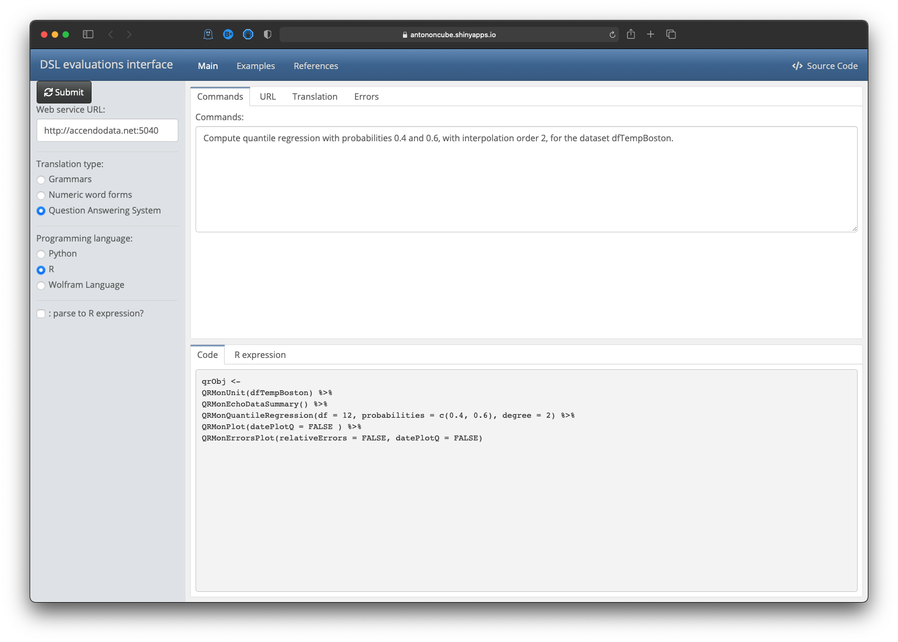

# NLP Template Engine

## In brief

This repository provides implementation, data, and documentation of a Natural Language Processing (NLP) 
[Template Engine (TE)](https://en.wikipedia.org/wiki/Template_processor), [Wk1], 
that utilized
[Question Answering Systems (QAS')](https://en.wikipedia.org/wiki/Question_answering), [Wk2],
and Machine Learning (ML) classifiers.

The current implementation of repository's NLP-TE is heavily based on the Wolfram Language (WL) 
built-in function
[`FindTextualAnswer`](https://reference.wolfram.com/language/ref/FindTextualAnswer.html), 
[WRI1].

In the future, we plan to utilize other -- both WL and non-WL -- QAS implementations.

### Problem formulation

We want to have a system (i.e. TE) that:

1. Generates relevant, correct, executable programming code based natural language specifications of computational workflows

2. Can automatically recognize the workflow types

3. Can generate code for different programming languages and related software packages

The points above are given in order of importance; the most important are placed first.

------

## Examples

### Latent Semantic Analysis

```mathematica
lsaCommand = "Extract 20 topics from the text corpus aAbstracts using
the method NNMF. Show statistical thesaurus with the words neural, function, and notebook";
lsaRes = Concretize["LSAMon", lsaCommand]
```

```mathematica
Hold[lsaObj =
    LSAMonUnit[aAbstracts]⟹
    LSAMonMakeDocumentTermMatrix["StemmingRules" -> Automatic, "StopWords" -> Automatic]⟹
    LSAMonEchoDocumentTermMatrixStatistics["LogBase" -> 10]⟹
    LSAMonApplyTermWeightFunctions["GlobalWeightFunction" -> "IDF", "LocalWeightFunction" -> "None", "NormalizerFunction" -> "Cosine"]⟹
    LSAMonExtractTopics["NumberOfTopics" -> 20, Method -> "NNMF", "MaxSteps" -> 16, "MinNumberOfDocumentsPerTerm" -> 20]⟹
    LSAMonEchoTopicsTable["NumberOfTerms" -> 10]⟹
    LSAMonEchoStatisticalThesaurus["Words" -> {"neural", "function", "notebook"}];
]
```

### Quantile Regression

```mathematica
qrCommand = 
  "Compute quantile regression with probabilities 0.4 and 0.6, with interpolation order 2, for the dataset dfTempBoston.";
lsaRes = Concretize[qrCommand]
```

```mathematica
Hold[
 qrObj = 
   QRMonUnit[dfTempBoston]⟹
   QRMonEchoDataSummary[]⟹
   QRMonQuantileRegression[12, {0.4, 0.6}, InterpolationOrder -> 2]⟹
   QRMonPlot["DateListPlot" -> False, PlotTheme -> "Detailed"]⟹
   QRMonErrorPlots["RelativeErrors" -> False, "DateListPlot" -> False, PlotTheme -> "Detailed"];
]
```

### Random tabular data generation

```mathematica
rtdCommand =
"Create a random dataset with 30 rows, 8 columns, and 60 values using column names generator RandomWord.";
res = Concretize["RandomDataset", rtdCommand]
```

```mathematica
Hold[ 
  ResourceFunction["RandomTabularDataset"][{30, 8}, 
    "ColumnNamesGenerator" -> RandomWord, "Form" -> "Wide", 
    "MaxNumberOfValues" -> 60, "MinNumberOfValues" -> 60, 
    "RowKeys" -> False]
]
```

------

## Interactive interface

Here is an interactive interface that gives "online" access to the functionalities discussed: 
["DSL evaluations interface"](https://antononcube.shinyapps.io/DSL-evaluations/).

[](https://antononcube.shinyapps.io/DSL-evaluations/)

(I order to try out repository's TE "Question Answering System" radio button have to selected.)

------

## Bring your own templates

0. Load the NLP-Template-Engine
   [WL package](./Packages/WL/NLPTemplateEngine.m):

```mathematica
Import["https://raw.githubusercontent.com/antononcube/NLP-Template-Engine/main/Packages/WL/NLPTemplateEngine.m"]
```

1. Get the "training" templates data (from CSV file you have created or changed) for a new workflow
   (["SendMail"](./TemplateData/dsQASParameters-SendMail.csv)):

```mathematica
dsSendMailTemplateEngineData = ResourceFunction["ImportCSVToDataset"]["https://raw.githubusercontent.com/antononcube/NLP-Template-Engine/main/TemplateData/dsQASParameters-SendMail.csv"];
Dimensions[dsSendMailTemplateEngineData]

(* {43, 5} *)
```

2. Add the ingested data for the new workflow (from the CSV file) into the NLP-Template-Engine:

```mathematica
NLPTemplateEngineAddData[dsSendMailTemplateEngineData] // Keys

(* {"Questions", "Templates", "Defaults", "Shortcuts"} *)
```

3. Parse natural language specification with the newly ingested and onboarded workflow ("SendMail"):

```mathematica
Concretize["SendMail", "Send email to joedoe@gmail.com with content RandomReal[343], and the subject this is a random real call.", PerformanceGoal -> "Speed"]

(* Hold[
 SendMail[
  Association["To" -> {"joedoe@gmail.com"}, 
   "Subject" -> "a random real call", "Body" -> RandomReal, 
   "AttachedFiles" -> None]]] *)
```

4. Experiment with running the generated code!

------

## References

### Articles

[JL1] Jérôme Louradour,
["New in the Wolfram Language: FindTextualAnswer"](https://blog.wolfram.com/2018/02/15/new-in-the-wolfram-language-findtextualanswer/),
(2018),
[blog.wolfram.com](https://blog.wolfram.com).

[Wk1] Wikipedia entry, [Template processor](https://en.wikipedia.org/wiki/Template_processor).

[Wk2] Wikipedia entry, [Question answering](https://en.wikipedia.org/wiki/Question_answering).

### Functions, packages, repositories

[AAr1] Anton Antonov,
[DSL::Shared::Utilities::ComprehensiveTranslation Raku package](https://github.com/antononcube/Raku-DSL-Shared-Utilities-ComprehensiveTranslation),
(2020),
[GitHub/antononcube](https://github.com/antononcube).

[ECE1] Edument Central Europe s.r.o.,
[https://cro.services](https://cro.services).

[WRI1] Wolfram Research,
[FindTextualAnswer]( https://reference.wolfram.com/language/ref/FindTextualAnswer.html),
(2018),
[Wolfram Language function](https://reference.wolfram.com), (updated 2020).

